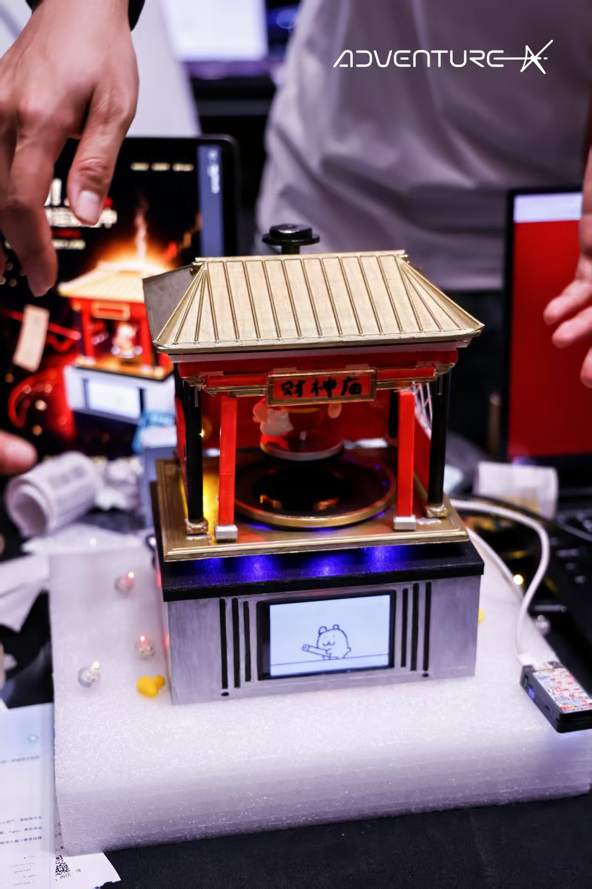
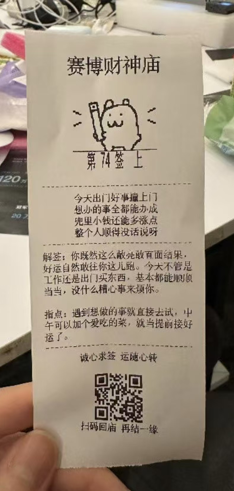
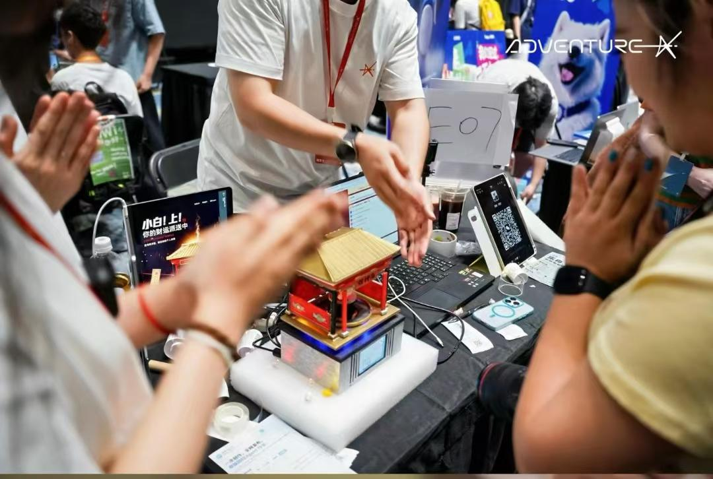

# 赛博财神庙 (MoneyGod)

AdventureX 2026 黑客松项目 — 一台桌面"财神"装置：摇签 → 抽档 → LLM 生成签诗 + 解签 → TTS 语音播报 → 热敏打印签条。

核心硬件基于 Tuya T5AI 开发板 + 热敏打印机 + 磁悬浮展示 + 摇签遥控器，外壳为 3D 打印件。后端 Python 服务提供签文生成、TTS 合成等 API。

> 详细架构与开发指南见 [`CLAUDE.md`](CLAUDE.md)。

## 成品展示

<p align="center">
  
  
</p>
<p align="center">
  
</p>

---

## 硬件清单 (BOM)

> 📝 搜索建议：可直接在淘宝/电商平台搜索以下商品名称。

### 核心电子模块

| # | 名称 | 型号 / 规格 | 用途 |
|---|------|------------|------|
| 1 | 雾化加湿器模块 | 适用 Arduino / ESP32，含连接线 | 财神烟雾效果 |
| 2 | 磁悬浮机芯 | 磁悬浮裸机机芯，悬浮展示架，负载 500–600 g (4B) | 财神悬浮展示 |
| 3 | 嵌入式热敏打印模块 | **EM5820H**，白色新版，5–9 V，USB 供电 | 签文打印 |

### 主控板

本项目使用涂鸦 **T5AI 开发板**，但也可使用其他支持相应外设的开发板（感谢清闲提供的香橙派 OrangePi 3B 对本项目完整运行的帮助）。

| 名称 | 说明 |
|------|------|
| **Tuya T5AI 开发板** | 主控，运行 `t5-dev/TuyaOpen/apps/cyber_fortune/` 固件。屏幕、TTS、BLE 摇签、网络抽签均在此板。 |
| **StickS3** | 摇签遥控器，PlatformIO 固件在 `stick-dev/`。通过 BLE 与 T5AI 通信。 |

### 3D 打印外壳

共 13 个 STL 零件（庙顶、庙身、底座、屏幕支架、热敏打印机支架、磁悬浮环等），详见 [`hardware/3d-models/README.md`](hardware/3d-models/README.md)。

### 硬件文档

- 屏幕 / 摄像头模块尺寸与原理图：[`t5-dev/hardware/`](t5-dev/hardware/)
- 热敏打印机 EM5820H 规格书与开发笔记：[`t5-dev/hardware/printer/EM5820H-USB打印开发笔记.md`](t5-dev/hardware/printer/EM5820H-USB打印开发笔记.md)
- 3D 打印外壳零件清单：[`hardware/3d-models/README.md`](hardware/3d-models/README.md)

---

## 项目结构

```
core-engine/          Python 后端 — 唯一运行的服务
t5-dev/               T5AI 板固件 + 构建/烧录脚本
  └─ TuyaOpen/        TuyaOpen SDK (git subtree)
stick-dev/            StickS3 摇签遥控器固件 (PlatformIO)
hardware/3d-models/   外壳 STL (13 件)
assets/               像素美术素材
scene_change_gifs/    动画
赛博财神庙_原创签谱.json   原始签诗数据
```

## 快速开始

```bash
# 后端
cd core-engine
cp .env.example .env          # 填入 ARK_API_KEY / VOLC_TTS_APPID / VOLC_TTS_TOKEN
.venv/bin/python quickstart.py   # 验证 LLM 连通
.venv/bin/python serve.py        # 启动签文 API (0.0.0.0:8000)

# 固件 (从仓库根目录)
bash t5-dev/cf_build.sh          # 增量编译
bash t5-dev/cf_flash.sh          # 烧录
bash t5-dev/cf_monitor.sh        # 串口监视
```

## License

MIT
